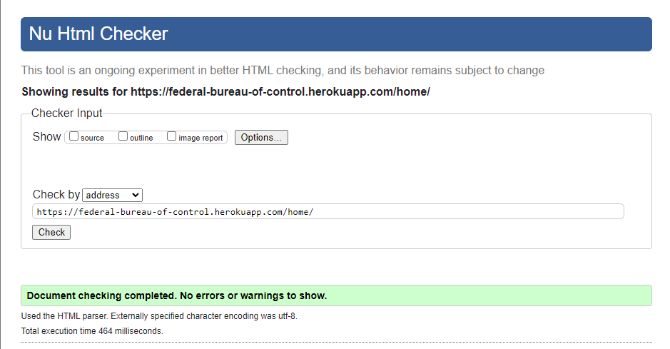
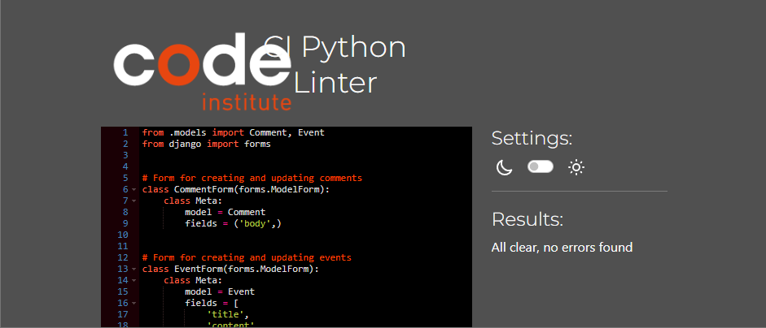
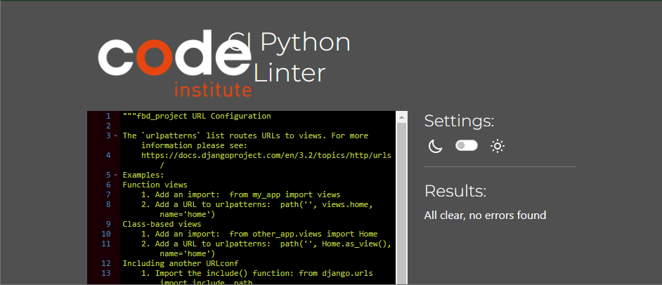
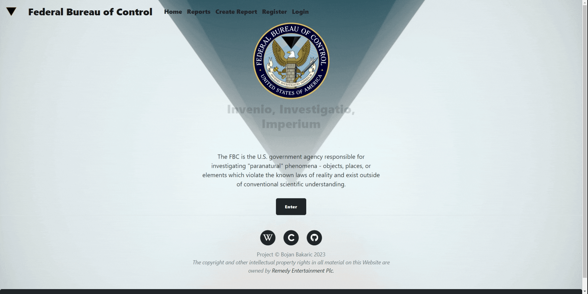
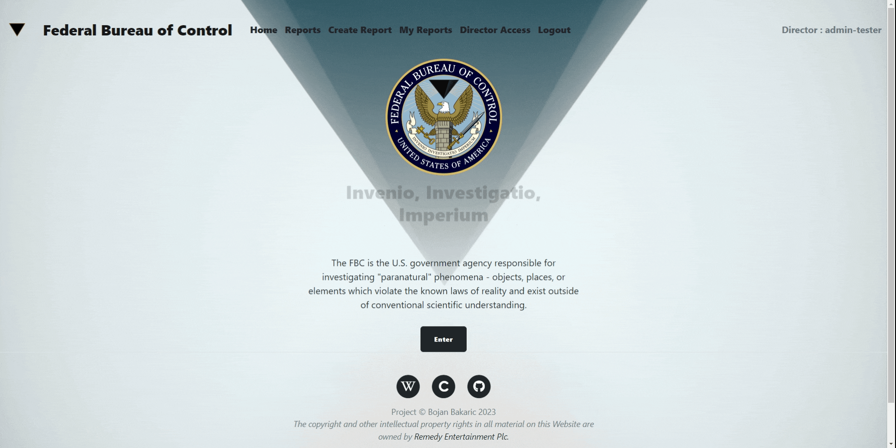
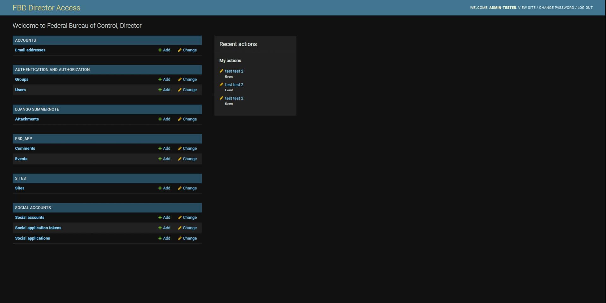
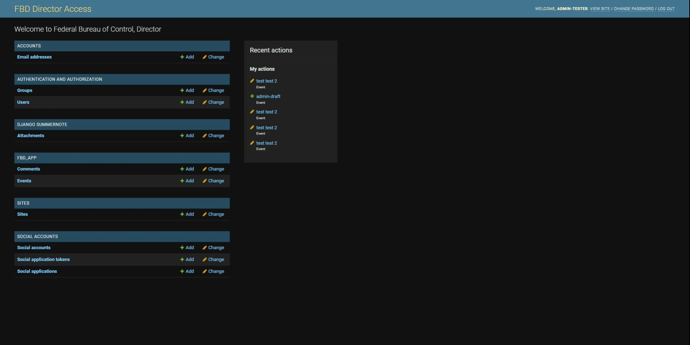
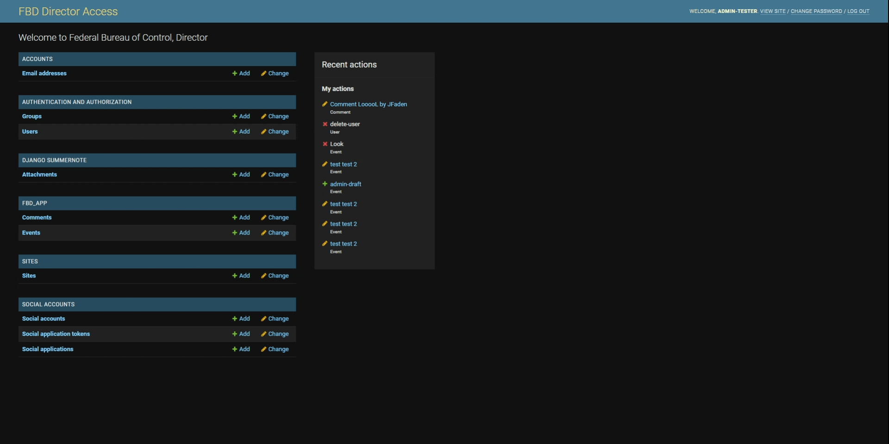
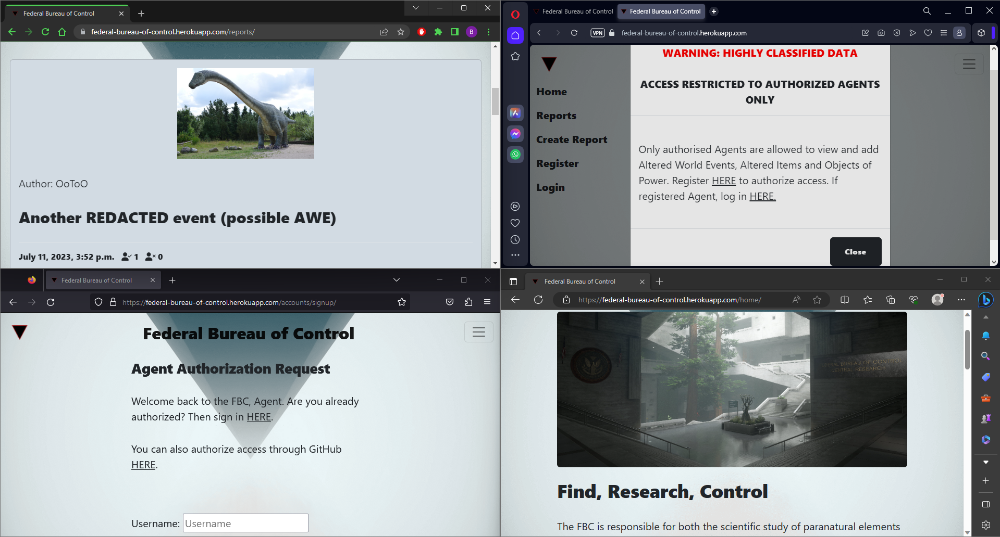

<!-- Code for readme adapted from author's own project (Portfolio 1),
https://github.com/Boiann/boudoir-studio -->

# **FEDERAL BUREAU OF CONTROL - Testing** 

[Main README.md file](/README.md)

Visit the live site [Here.](https://federal-bureau-of-control.herokuapp.com/ "Link to Federal Bureau of Control")

Visit the GitHub repository [Here.](https://github.com/Boiann/federal-bureau-of-control "Link to Federal Bureau of Control GitHub repository")

---
## **Contents**
* [Automated Testing](#automated-testing)
  * [W3C HTML Validator](#w3c-html-validator)
  * [W3C CSS Validator](#w3c-css-validator)
  * [JSHINT Javascript Validator](#jshint-javascript-validator)
  * [CI Python Linter](#ci-python-linter)
  * [Lighthouse](#lighthouse)

* [Accessibility](#accessibility) 
  * [WAVE WebAim](#wave-webaim) 

* [Manual Testing](#manual-testing)
  * [Testing User Stories](#testing-user-stories)

  * [Full Testing](#full-testing)
    * [Features](#features)
    * [Responsiveness](#responsiveness)

* [Bugs](#bugs)
  * [Known Bugs](#known-bugs)
  * [Solved Bugs](#solved-bugs)

* [Browser Compatibility](#browser-compatibility)      

---

## Automated Testing

### **W3C HTML Validator**

The [HTML W3C HTML Validator](https://validator.w3.org/#validate_by_uri+with_options) was used to validate the HTML code used, showing no errors except on single report page, 'strike' element is obsolete. As this is a feature (text censoring from admin site) and works as intended, the error is disregarded.

 - Index
  

 

 - Home
  

 

 - Reports
  

 

 - Login
  

 

 - Logout
  

 

 - GitHub Login
  

 

 - Register
  

 

 - Single Report
  

 

 - Add Report
  

 

 - Update Report
  

 

 - Delete Report
  

 

 - My Reports
  

 

### **W3C CSS Validator**

The [CSS Jigsaw CSS Validator](https://jigsaw.w3.org/css-validator/#validate_by_uri) was used to validate the CSS code used, showing no errors on the customized style.css, uploaded by direct input.

 - CSS validation
  

 

### **JSHINT Javascript Validator**

The [JsHint](https://jshint.com/) was used to validate the Javascript code used, showing no errors.

 - Javascript validation
  

 

### **CI Python Linter**

The [CI Python Linter](https://pep8ci.herokuapp.com/) was used to validate the Python code used, showing no errors except for one 'line too long' in settings.py. This could not be resolved despite best efforts.

 - admin.py
  

 

 - forms.py
  

 

 - manage.py
  

 

 - models.py
  

 

 - settings.py
  

 

 - urls.py
  

 

 - urls.py-project
  

 

 - views.py
  

 

### **Lighthouse**

The [LightHouse](https://developer.chrome.com/docs/lighthouse/overview/) was used for testing performance.

#### **Desktop**

 - Index
  

 

 - Home
  

 

 - Reports
  

 

 - Single Report
  

 

 - Login
  

 

 - Logout
  

 

 - Register
  

 

 - Create Report
  

 

 - Update Report
  

 

 - Delete Report
  

 

#### **Mobile**

 - Index
  

 

 - Home
  

 

 - Reports
  

 

 - Single Report
  

 

 - Login
  

 

 - Logout
  

 

 - Register
  

 

 - Create Report
  

 

 - Update Report
  

 

 - Delete Report
  

 

[Back to top ⇧](#federal-bureau-of-control---testing)

---

## **Accessibility**

### **WAVE WebAim**

The [W.A.V.E.](https://wave.webaim.org/) was used to test for accessibility, showing no errors except for a single report page on censored (blacked-out) text. As this is a feature and works as intended, the contrast errors are disregarded.

 - Index
  

 

 - Home
  

 

 - Reports
  

 

 - Single Report
  

 

 - Login
  

 

 - Logout
  

 

 - Register
  

 

 - GitHub Login
  

 

[Back to top ⇧](#federal-bureau-of-control---testing)

## **Manual Testing**

### **Testing User Stories**

#### **First Time Visitor**
  * **I want to know what FBC is**
    * When the index/splash page loads it is clear right away what this page is for. The animated page title and a short description paired with content warning modal make it obvious this is a fan-made site.
    * PASS

  * **I want to navigate the website intuitively**
    * The site is comprised of ux-friendly and intuitive navbar.
    * PASS

  * **I want to find additional information**
    * More info is available even to the unregistered user on the home page.
    * PASS

  * **I want to check out Control(game)**
    * The links in the footer lead to more information about the project's GitHub repository, more about the Control game and the developers of the game.
    * PASS

  * **I want to become an Agent of the FBC**
    * Any user willing to submit an username and password or link their GitHub account is able to register with the site and become an 
    Agent.
    * PASS

#### **Returning User/Agent**
  * **I want to log in securely**
    * Site user can log in securely with no compromise of the password/username, no one can change/delete reports and comments besides admin.
    * PASS

  * **I want to submit my own report**
    * Report submission is enabled as soon as an Agent is registered to the site.
    * PASS

  * **I want to see my report submission**
    * After a repost is submitted, it can be found on "My Reports" page, even if not yet approved and published by admin.
    * PASS

  * **I want to modify my report**
    * After clicking on user's own report clearly visible and distinctly colored green button will allow the user to modify their report.
    * PASS

  * **I want to delete my report**
    * After clicking on user's own report clearly visible and distinctly colored red button will allow the user to delete their report.
    * PASS

  * **I want to add my comment to a report**
    * Any registered Agent can submit their comment to a Report and participate in the discussion.
    * PASS

  * **I want to approve/deny a report**
    * Any registered Agent can approve/deny (like, dislike) the reports, adding to their respective counters.
    * PASS

#### **Website Admin/Director**
  * **I want to log in securely and have admin access**
    * Superuser (admin) was created and only the superuser has the ability to open the admin page.
    * PASS

  * **I want to approve and publish user reports**
    * After the user submits the Report, it is not yet visible on the "Reports" page. Only after the admin approves and publishes the report will it be visible to all the users.
    * PASS

  * **I want to see published and approved user reports**
    * Using Django admin site, admin can see the list of submitted reports. Using the tab located on the right the admin can select appropriate filter to list the Reports (All/Approved/Published).
    * PASS

  * **I want to modify user reports and comments**
    * Admin can modify any user report or comment.
    * PASS

  * **I want to delete user reports and comments**
    * Admin can modify any user report or comment.
    * PASS

[Back to top ⇧](#federal-bureau-of-control---testing)

---

### **Full Testing**

#### **Features**

##### **Intro/splash/index**

Content disclaimer firing when opening the page for the first time, not firing on subsequent visit, spinning logo and animated center text working

Content disclaimer firing when the user clicks on it, link inside the modal opens in a new tab, close modal button working

Footer links open in a new tab, tooltips present on logo, title and footer links working

##### **Home**

Unregistered user can open home page, warning modals for reports/create reports working

Unregistered user warning modal links and close button working

Home page 'More Info' modals working

##### **Sign Up**

Cross-links between Sign-up and Log In working

Successful registering success message working

##### **Log In/Out**

Successful login success message, Agent name in top right corner working

GitHub log in working

Sure you want to log out page, logging out success message, no Agent name in top right corner working

##### **Reports**

Paginated view of reports with like/dislike counters, next/back page button working

Open an report, like/dislike buttons working

Adding a comment, comments counter updating, if no comments - message working

##### **Create Report**

Adding a report, template image if no image uploaded, director approval needed message and redirect to My-Reports page, added report not visible on Reports page working

##### **My Reports**

Paginated view of user's reports, unique for each user, Update/Edit and Delete buttons show up for user's own report working

Update Report and success message working

Delete Report, 'are you sure' question and success message working

##### **Admin/Director site differences**

Director access extra nav link for admin opening admin page in a separate tab, top right corner changes from Agent: *user* to Director: *user* working

Reports and Create Report has no warning text for admin working

##### **Admin page**

Admin can approve and publish report, visible on Reports page to a normal user working

Admin can create a draft report working

Admin can change a report, censoring perk working

Admin can delete a report and user working

Admin can approve and change a comment working

Admin can delete a comment working

##### **Error pages**

Error 400 (page not found) page with 'Go Home' button working

Error 500 (internal server error) page with 'Go Home' button working

---

[Back to top ⇧](#federal-bureau-of-control)

---

#### **Responsiveness**

Responsiveness for the website was thoroughly tested for devices up to 320px wide. 
The website still works well on a device 280px wide, with visible difficulties with reading the text below that width.

Responsiveness

[Back to top ⇧](#federal-bureau-of-control---testing)

---

## **Bugs**

### **Known Bugs**

* An uncaught TypeError is thrown when the pages load. This does not seem to cause any performance issues. The reason that it is unfixed is that it is triggered by the Bootstrap JavaScript method having to do with the closing the alert message. The method timeout in which alert.close() is called is taken directly from Code Institute.

### **Solved Bugs**

There were many 'small' bugs the author had to deal with during the development of the project. Most of them were squashed by doing a quick [Google](https://google.com/ "Google home page") search and using [Stack Overflow](https://stackoverflow.com/ "Stack Overflow home page") to find relevant solutions.

There was an issue with email and email verification. When working on the project and debug was set to true, after email submission the verification message was sent inside terminal. This was looked into and it was found that it is normal to email verification to go through terminal when debug is true. It was assumed this is working normally. Only later in the development cycle when debug was set to false, it was discovered that the email verification and password reset doesn't work. Again because of fast approaching project submission date, the email and email input field was left out entirely.

Issues with database were the scariest and for the sake of project stability and to be able to submit the project on time, this was left as is. It does not hinder the site operation in any way. The solutions were looked for and most of them end with rebuilding the database, creating new tables and moving the data around, for example on [this page](https://www.pythonsolver.com/pythonerrors/how-to-fix-the-python-integrityerror-error/).

- Detailed description:

After trying to add the "approved or not" option for the admin when the admin is submitting a report through website (not through admin panel), "approved" was added in admin.py and models.py.
After migrating the desired outcome was not working, abandoning the feature.
And then deleting added/migrated changes, the Database Integrity error was showing up.
This is where it was discovered that database cannot be repaired/reset by deleting or switching branches or reverting a commit.
Simplest solution was to just put the "approved" back into the model class.

The other time this was encountered was with error when from admin page, admin needs to update the user's comment but the user has no email submitted.
The error warning asks for email field to be populated. This is easily solved with submitting anything with @ and .com, but this was not optimal.
Again, this could have been handled with models/database approach but it was decided to circumvent the issue by using get_form override, rather than risking database errors so close to submission deadline. The code was found and adapted from [Stack Overflow](https://stackoverflow.com/questions/43402284/django-admin-get-form-override).

This is one thing to be more careful in the future if making database-related projects, a valuable lesson that will be remembered in the future. 

[Back to top ⇧](#federal-bureau-of-control---testing)

---

## **Browser compatibility**

The website was tested on the following browsers with no issues found: Google Chrome, Mozzilla Firefox, Microsoft Edge and Opera Browser.

 - Browser Compatibility
  

 

[Back to top ⇧](#federal-bureau-of-control---testing)

***